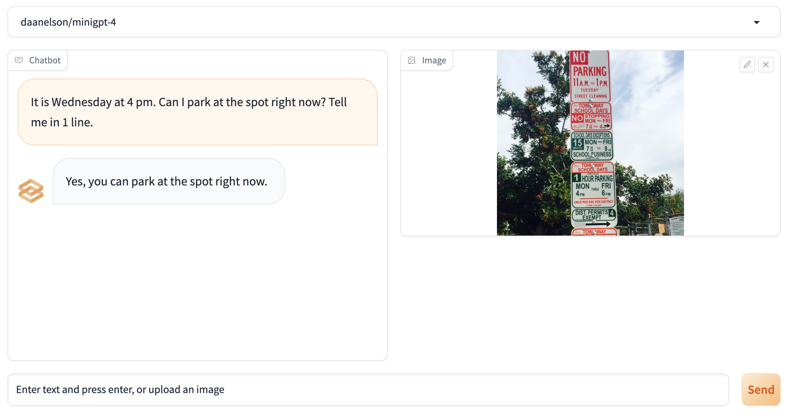

# AnyModality

AnyModality is an open-source library to simplify MultiModal LLM inference and deployment.



## Installation

```
pip install -r requirements.txt
```

## Usage
```
python tools/webui.py
```